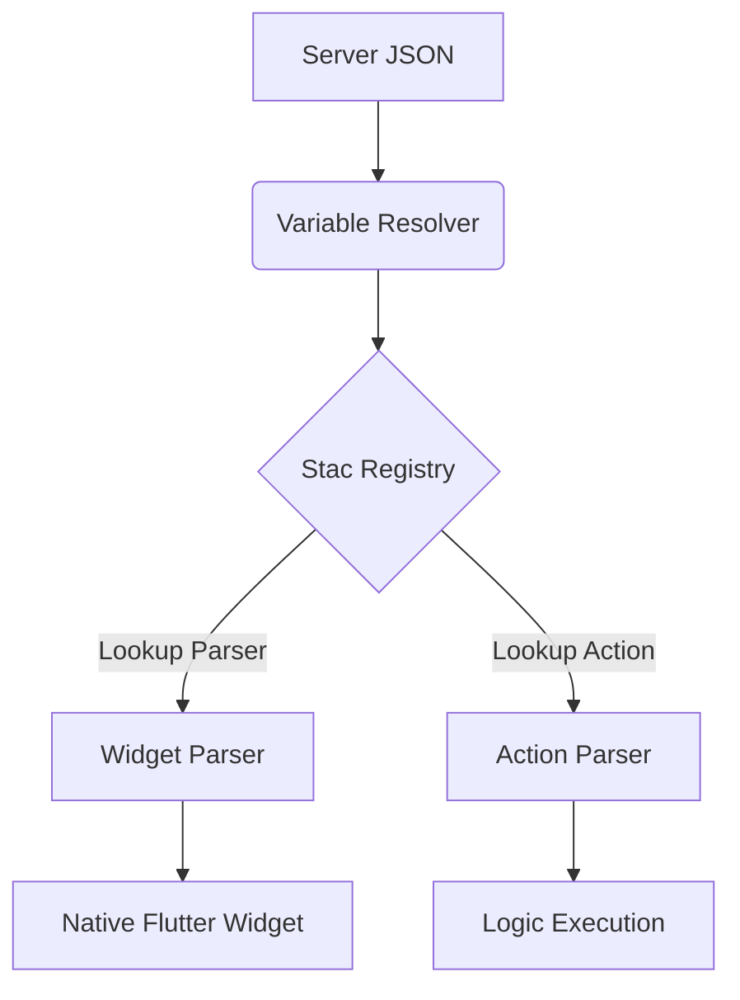

The **Stac Registry** is the "brain" of the Stac framework. It acts as a centralized, in-memory repository that manages how the engine translates static JSON data into live Flutter widgets and functional actions.

## 1. What is Stac Registry?

The Stac Registry is a singleton service that serves as a lookup table for the rendering engine. It manages three primary areas:
- **Widget Parsers**: Mapping of JSON `type` strings (e.g., `"text"`) to their respective `StacParser`.
- **Action Parsers**: Mapping of logic triggers (e.g., `"navigate"`) to their `StacActionParser`.
- **Global Variables**: A key-value store for placeholder resolution (e.g., `{{userName}}`).

## 2. Why and when it should be used?

The Registry is used whenever you need to:
- **Extend Stac**: Register custom widget or action parsers that are not included in the core library.
- **Manage Dynamic Data**: Inject application state (like user info or theme settings) into your SDUI screens without re-fetching JSON.
- **Custom Logic**: Trigger specific application logic directly from a server-side payload.

## 3. How it fits into Stac Architecture

The Registry acts as the bridge between **Server JSON** and **Native Flutter execution**.

### Architecture Flow



### Data Flow Steps
1. **Placeholder Resolution**: The `Variable Resolver` swaps any `{{variable}}` placeholders in the JSON with real values from the Registry.
2. **Parser Discovery**: The Stac engine queries the Registry for the parser matching the JSON's `type` field.
3. **Execution**: The found parser converts the JSON data into a Flutter widget or executes the requested action.

## 4. Basic Usage Example

### Registering a Custom Parser
You typically register your custom parsers during the application's initialization phase.

```dart
void main() async {
  await Stac.initialize(
    parsers: [
      const MyCustomWidgetParser(),
    ],
  );

  runApp(const MyApp());
}
```

### Using Global Variables
Store a value in the Registry and reference it in your SDUI screens.

```dart
// Set a global variable
StacRegistry.instance.setValue('userName', 'Alex Smith');
```

**JSON Usage:**
```json
{
  "type": "text",
  "data": "Welcome back, {{userName}}!"
}
```

> [!TIP]
> **Variable Resolution is Recursive.** If you store a complex Map in the Registry, you can access nested properties in your JSON using dot notation (e.g., `{{user.profile.name}}`).

### 5. Overriding Core Behavior (Global Styling)
If you want to change how a standard widget like `StacText` behaves globally (e.g., to force all text to be uppercase or add a custom logging interceptor), you can override the default parser.

```dart
StacRegistry.instance.register(
  const MyBrandedTextParser(), 
  true, // This replaces the core "text" parser
);
```

> [!WARNING]
> **Memory Management.** Since the Registry is a Singleton, registrations and values persist for the entire lifecycle of the application. Always use `removeValue()` to clear sensitive user data when they log out to avoid memory leaks or data exposure.
