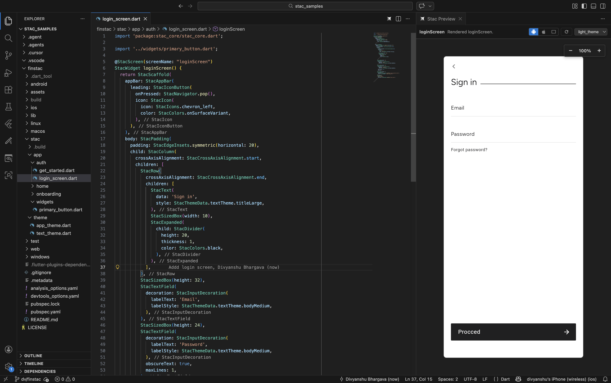

# Stac — Server-Driven UI for Flutter

Build and preview Server-Driven UI screens with the **Stac** framework — directly inside VS Code.

## ✨ Features

### 🔴 Live Preview
Open a side-by-side preview of any `@StacScreen` — updates on save, supports theme selection, and renders with Android/iOS/Web platform simulation.

- **`Stac: Open Preview`** — launch the preview panel for the active screen
- **Device toggles** — switch between Android, iOS, and Web viewports
- **Theme picker** — select any `@StacThemeRef` theme to preview with

### 🔧 Wrap Quick Fixes
Place your cursor on any Stac widget expression and press **Cmd+.** to wrap it:

- `StacContainer`, `StacPadding`, `StacCenter`, `StacAlign`, `StacSizedBox`, `StacExpanded`
- **Wrap with Stac widget…** — type any Stac widget class name

### 📝 Snippets
Type in a Stac DSL context (files containing `@StacScreen`, `@StacThemeRef`, or `package:stac_core`):

- `stac screen` — new screen template
- `stac theme` — new theme template

## ⚙️ Extension Settings

| Setting | Default | Description |
|---|---|---|
| `stacVscode.enableWrapQuickFix` | `true` | Enable wrap quick-fix actions |
| `stacVscode.wrapPresets` | All presets | Preset wrappers in quick-fix menu |
| `stacVscode.enableSnippets` | `true` | Enable `stac screen`/`stac theme` snippets |
| `stacVscode.preview.enable` | `true` | Enable preview commands |
| `stacVscode.preview.autoRefreshOnSave` | `true` | Refresh preview on save |
| `stacVscode.preview.jsonStrategy` | `runnerThenBuild` | JSON generation strategy |
| `stacVscode.preview.hostPort` | `47841` | Local preview host port |
| `stacVscode.preview.startupTimeoutMs` | `120000` | Host startup timeout |

## Requirements

- **Flutter SDK** with Dart `3.9.2+`
- A Flutter project using the [Stac](https://stac.dev) framework

## Commands

| Command | Description |
|---|---|
| `Stac: Open Preview` | Open live preview panel |
| `Stac: Select Preview Screen` | Switch to a different screen in the current file |
| `Stac: Stop Preview` | Stop the preview host |
| `Stac: Regenerate Catalog` | Rebuild widget catalog from `stac_core` |

## Troubleshooting

If the preview doesn't start, open **Output → Stac Preview** for detailed logs.

## Links

- [Stac Documentation](https://stac.dev)
- [GitHub Repository](https://github.com/StacDev/stac)
- [Report Issues](https://github.com/StacDev/stac/issues)

## License

[MIT](LICENSE)
